# DAU Protocol Reference

**Project:** packet_shim  
**Audience:** Anyone who needs to understand the actual bytes on the wire — developer, tester, or curious technician.

---

## 1. How We Figured Out the Protocol

We did not have any documentation for this protocol. Everything here was discovered by watching live traffic between the DAU hardware and a working Windows 7 machine using Wireshark.

The method was simple: **do one action in the application, then look at what appeared in Wireshark**. Repeat for every button in the UI.

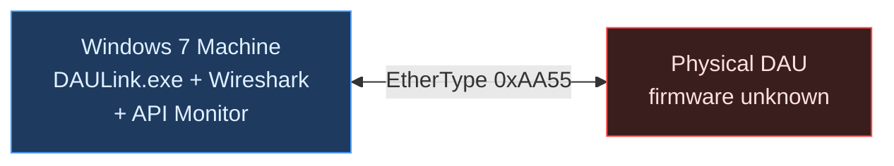

### Step-by-step Discovery

| Action in the UI | What appeared in Wireshark | What we called it |
|---|---|---|
| Application launched | Short frames in both directions, bytes `01 01`, repeating every ~1 second | **PING** — a heartbeat |
| Clicked "List Files" | App sent `01 02`, DAU replied `01 02` with readable text | **FILE-LIST** |
| Selected a file, got info | App sent `01 05`, DAU replied `01 05` with structured data | **FILE-SCAN** |
| Clicked "Download" | App sent `01 06` with filename, DAU replied with file size info | **FILE-REQ / FILE-META** |
| While downloading | Hundreds of identical-length frames from DAU at wire speed | **FILE-CHUNK** |
| End of each burst | One short frame from DAU with bytes `02 02` | **FILE-ACK** (window boundary) |
| After FILE-ACK | Another short frame from DAU with bytes `01 0C` | **DAU-POLL** |
| App responding to poll | App sent `02 04`, short frame | **NEXT-WIN** |
| Download finished | DAU sent `02 03` | **FILE-DONE** |
| Something went wrong | App sent `02 05` | **ABORT** |

---

## 2. Ethernet Frame Layout (All Types)

Every frame on this network uses EtherType `0xAA55`. The first 14 bytes are the standard Ethernet header. The protocol payload starts at byte 14.

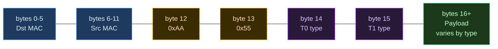

> [!NOTE]
> **Minimum Ethernet frame is 60 bytes.** If the actual data is shorter, the NIC hardware pads with zeros up to 60 bytes. This matters for small frames like FILE-ACK and DAU-POLL — their payload fields fall in the zero-padded region and must be read carefully.

---

## 3. Frame Type Reference

### 3.1 PING — `01 01` (Both Directions)

A heartbeat. Sent by both sides every ~1 second when idle. No payload.

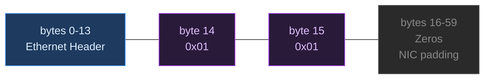

---

### 3.2 FILE-LIST — `01 02` (Both Directions)

**App→DAU:** "Give me the list of files."  
**DAU→App:** "Here are the files." (payload contains filenames)

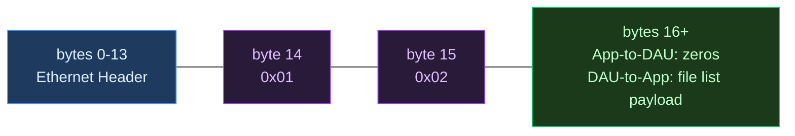

---

### 3.3 FILE-SCAN — `01 05` (Both Directions)

**App→DAU:** "Give me metadata for a specific file."  
**DAU→App:** "Here's that file's info." (~159 bytes per file)

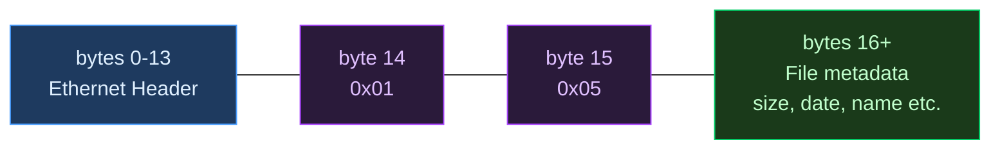

---

### 3.4 FILE-REQ and FILE-META — `01 06` (Both Directions)

**App→DAU:** "Download this specific file." (contains filename, download parameters)  
**DAU→App:** "OK, here's the file metadata." (total block count, size, etc.)

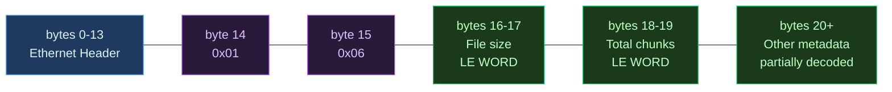

**DAU→App FILE-META field breakdown:**

| Bytes | Field | Notes |
|---|---|---|
| `[14..15]` | Type `01 06` | Confirms this is FILE-META |
| `[16..17]` | File size | LE WORD |
| `[18..19]` | Total chunk count | LE WORD — cross-referenced against actual file sizes to confirm |
| `[20..N]` | Other metadata | Partially decoded |

---

### 3.5 FILE-CHUNK — `02 01` ⭐ (DAU→App, High Volume)

This is the bulk data. Hundreds to thousands of these arrive per window at wire speed.

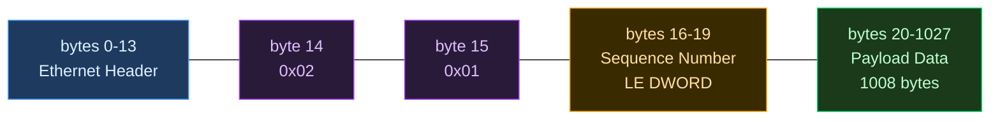

**Sequence number progression example:**

| Frame | Seq (hex) | Seq (decimal) |
|---|---|---|
| Frame 1 | `0x00000000` | 0 |
| Frame 2 | `0x00000001` | 1 |
| Frame 100 | `0x00000063` | 99 |
| *(then FILE-ACK arrives)* | — | — |

> [!TIP]
> All FILE-CHUNK frames are exactly **1028 bytes** (14 header + 1014 payload). Bytes `[16..19]` increment by exactly 1 for each successive frame and reset at the start of each new window after NEXT-WIN. This pattern was unambiguous — it must be a sequence number.

---

### 3.6 FILE-ACK — `02 02` ⭐ (DAU→App, Once Per Window)

Signals the end of a window. The application reads this and decides whether all chunks arrived.

```mermaid
graph LR
    A["bytes 0-13\nEthernet Header"] --- B["byte 14\n0x02"] --- C["byte 15\n0x02"] --- D["bytes 16-17\nRunning Seq\nLE WORD"] --- E["bytes 18-19\nSecondary\nunknown"] --- F["bytes 20-21\nCONST 0x0003\nNOT chunk count"] --- G["bytes 22-23\nWindow Number\nLE WORD"] --- H["bytes 24-25\nChunk Count\nLE WORD"] --- I["bytes 26-59\nZeros\nNIC padding"]

    style A fill:#1e3a5f,color:#e0f0ff,stroke:#4a9eff
    style B fill:#2a1a3a,color:#e0c0ff,stroke:#aa44ff
    style C fill:#2a1a3a,color:#e0c0ff,stroke:#aa44ff
    style D fill:#1a3a1a,color:#c0ffcc,stroke:#00cc66
    style E fill:#2a2a2a,color:#888888,stroke:#555555
    style F fill:#4a1e1e,color:#ffaaaa,stroke:#cc2200
    style G fill:#1a3a1a,color:#c0ffcc,stroke:#00cc66
    style H fill:#3a2a00,color:#ffe0a0,stroke:#ffaa00
    style I fill:#2a2a2a,color:#888888,stroke:#555555
```

> [!WARNING]
> **The `0x0003` constant at bytes `[20..21]` looks like a chunk count but is NOT.** We initially suspected it because 3 seemed plausible. It took multiple file transfers of different sizes to confirm it **never changes**. The real chunk count is at `[24..25]`.

**Field Reference:**

| Bytes | Field | Notes |
|---|---|---|
| `[16..17]` | Running sequence | Increments across all windows; ignored by shim |
| `[18..19]` | Secondary field | Purpose unclear; ignored |
| `[20..21]` | Protocol constant `0x0003` | Always this value; NOT chunk count ⚠️ |
| `[22..23]` | Window number (LE) | Which window this ACK covers |
| `[24..25]` | Chunk count (LE) | How many chunks the DAU believes it sent |

---

### 3.7 DAU-POLL — `01 0C` (DAU→App)

The DAU asks "are you ready for the next window?" Sent after every FILE-ACK, repeated every ~500 ms until a NEXT-WIN response is received.


> [!NOTE]
> If the application goes silent (never sends NEXT-WIN), the DAU keeps sending DAU-POLL every ~500 ms indefinitely. You will see these flooding the log file any time the transfer is stalled.

---

### 3.8 NEXT-WIN — `02 04` ⭐ (App→DAU)

The application's response to DAU-POLL. Two very different meanings depending on the `missing` field.

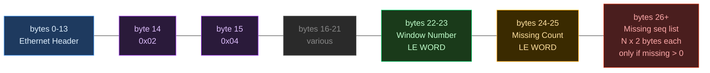

**Two cases based on `Missing Count`:**

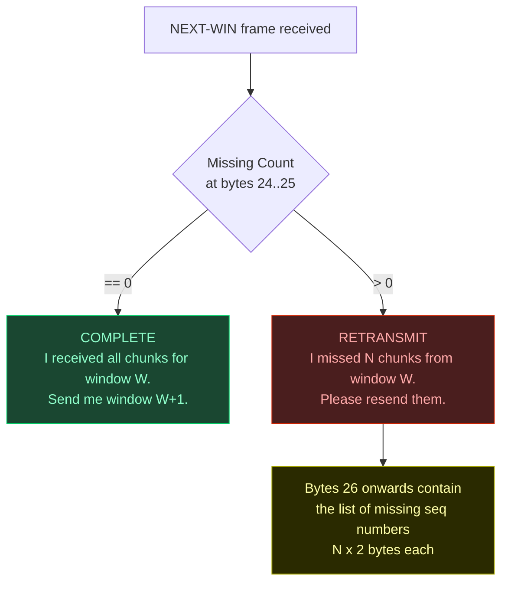

| Frame size | Meaning |
|---|---|
| 60 bytes | Simple COMPLETE (`missing=0`) |
| 84 bytes | COMPLETE with extra info |
| 228 bytes | RETRANSMIT with 100-chunk missing list |

---

### 3.9 FILE-DONE — `02 03` (DAU→App)

Transfer complete. The DAU has sent all windows.

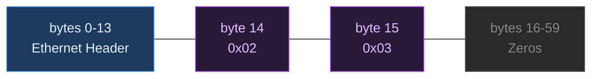

---

### 3.10 ABORT — `02 05` (App→DAU)

The application is giving up. If you see this in the log, the transfer failed.

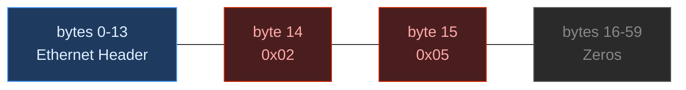

> [!CAUTION]
> Check what happened in the seconds **before** the ABORT in the log file. Typical causes: DAU-POLL flooding (shim not advancing state), or a spurious COMPLETE that confused the DAU state machine.

---

## 4. The Window-Based Download Loop

The entire file is divided into "windows". Each window is one burst of chunks followed by an acknowledgement cycle.

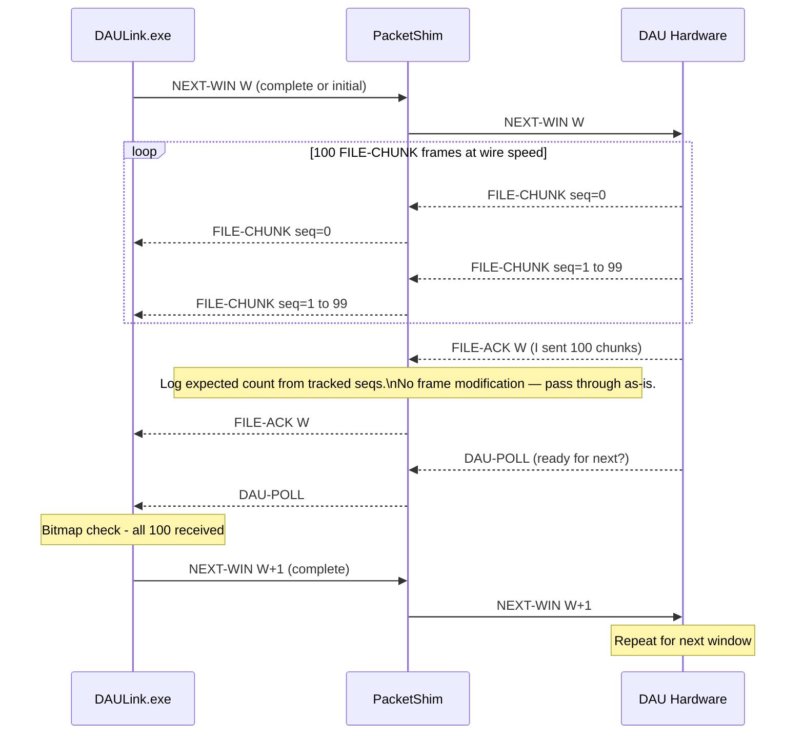

---

## 5. The Chunk Bitmap — Explained

### What is it?

When the DAU sends a window of data, each chunk has a unique sequence number. FLS30 internally maintains a checklist — one slot per expected chunk.

### What happens when FILE-ACK arrives?

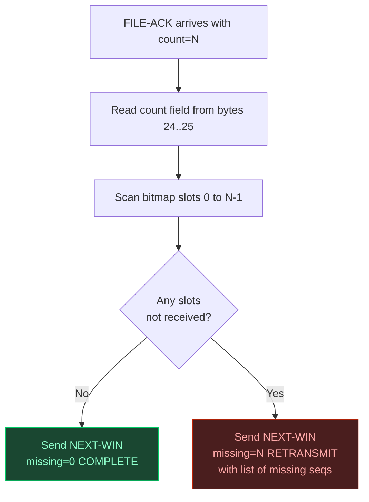

### The Zero-Count Bug


> [!IMPORTANT]
> The shim independently tracks `windowMinSeq` and `windowMaxSeq` from the FILE-CHUNK stream it sees. When a FILE-ACK arrives it computes `expected = maxSeq − minSeq + 1` and writes both numbers to the log file. **No frame patching is performed** — the DAU hardware always populates `[24..25]` correctly on current hardware. The sequence tracking exists as a diagnostic sanity check: if you ever see a large discrepancy between `expected` and what the FILE-ACK reports, it means chunks were dropped or duplicated upstream.
>
> The zero-count scenario (loop never runs → trivially COMPLETE) was investigated during early debugging when it was unclear whether the count field was always populated. On verified hardware it has never been observed.

---

## 6. The RetxWait State Machine — Full Detail

### Why it exists

When FLS30 detects missing chunks, it sends a RETRANSMIT NEXT-WIN. Due to a race condition in its asynchronous processing pipeline, it **immediately** follows this with a COMPLETE NEXT-WIN for the *previous* window. If both reach the DAU, the DAU cancels the retransmit — causing a guaranteed stall.

### State Machine

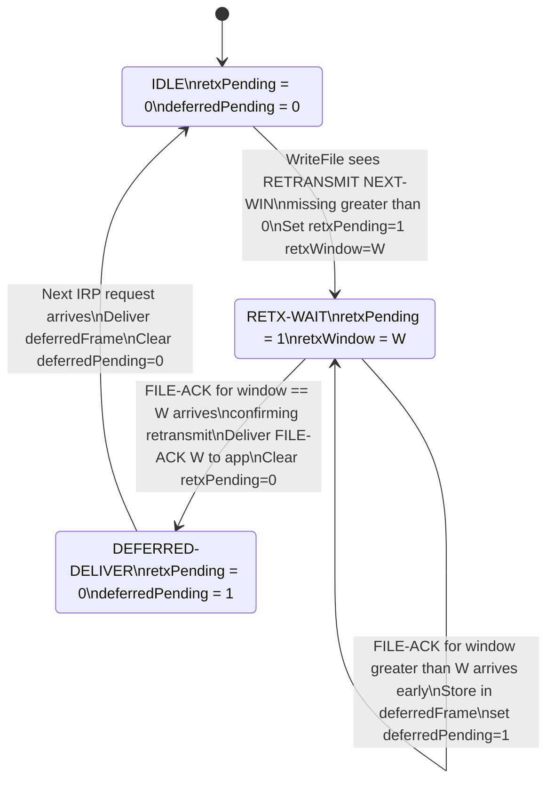

### Timeline Example (One Retransmit Event)

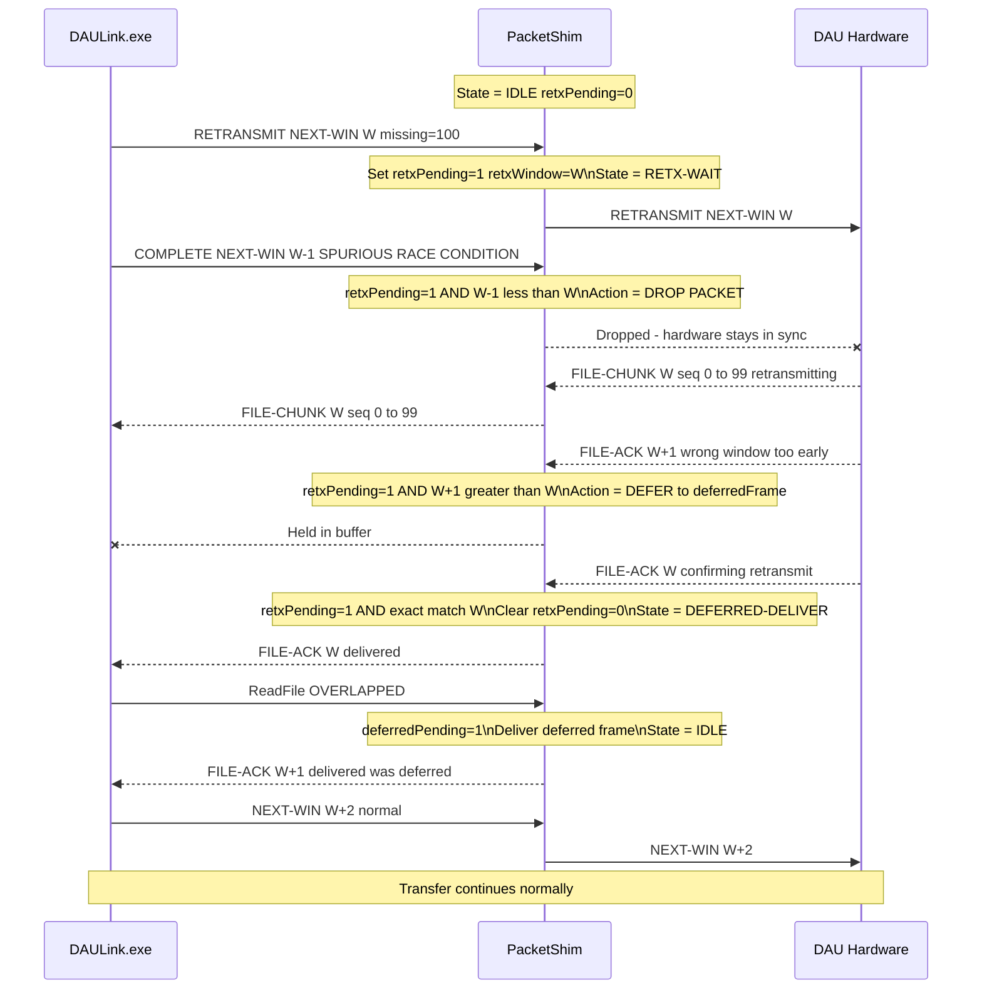

---

## 7. The Async IRP Queue — How ReadFile Works

### The Problem

`ReadFile` normally blocks: you call it, you wait, data arrives, it returns. FLS30 uses **overlapped (async) I/O** — it submits several ReadFile requests simultaneously and keeps doing other things while waiting. This is how it keeps up with a fast data stream.

Npcap does not support overlapped I/O the way the legacy WinPcap driver did. The shim must emulate it using a circular IRP queue.

### Architecture

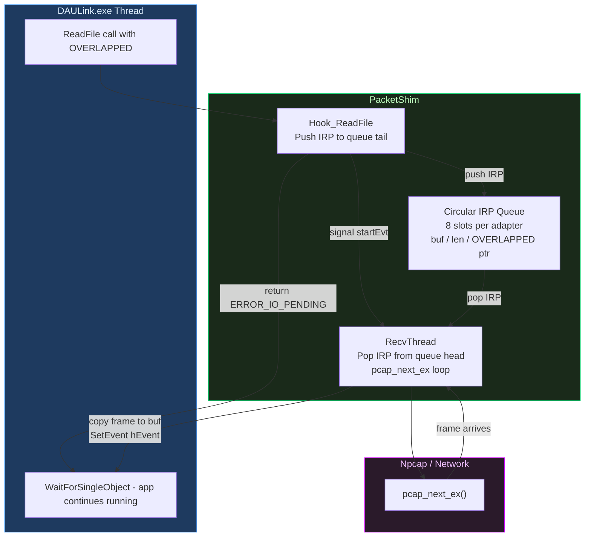

### Full Async Flow

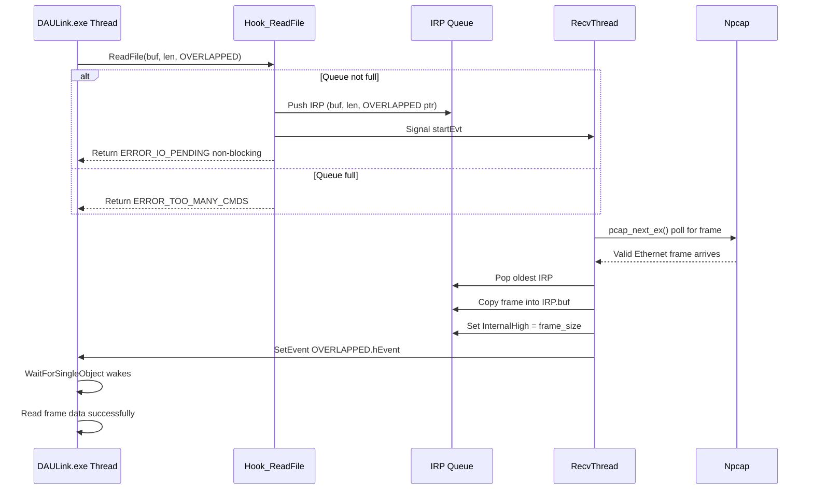

---

## 8. The Two-Tier Logging System

```mermaid
flowchart TD
    A["fls30_shim.ini\n[Debug] section"] --> B{"Logging= key"}

    B -->|"Logging=0\nSilent"| ZERO["Zero output.\nNo file opened.\nNo OutputDebugStringW.\nNo overhead at all."]
    B -->|"Logging=1\nDefault"| ONE["Logging active.\nOne banner line printed,\nthen split by event type."]

    ONE --> LF["LogFile()\nFile only\nC:/FLS_DOWNLOAD/shim_YYYYMMDD-HHMMSS.log\nPer-window events: chunk counts,\nwindow numbers, ACK delivery,\ndeferred frame delivery"]
    ONE --> LOG["Log()\nFile AND OutputDebugStringW\nReserved for infrequent events:\nstartup, errors, RetxWait start/clear,\nABORT frames, IRP queue overflow"]

    style ZERO fill:#1a4731,color:#90ffcc,stroke:#00cc66
    style ONE fill:#1e3a5f,color:#e0f0ff,stroke:#4a9eff
    style LF fill:#1a2a3a,color:#a0c8ff,stroke:#4488cc
    style LOG fill:#4a2000,color:#ffd0a0,stroke:#ff8800
```

> [!CAUTION]
> **The Heisenbug:** `OutputDebugStringW` acquires a kernel-wide mutex (`DBWinMutex`). When DebugView is open and listening, each `Log()` call can stall the calling thread for ~1–2 ms while it waits for that mutex. `RecvThread` calls `Log()` on every packet — at 2,400 packets/second that adds up to **minutes** of blocking, which starves Npcap's receive buffer and drops frames. The fix: use `LogFile()` (file write only, no mutex) for anything in the hot path, and `Log()` only for the handful of events that happen once per transfer. Run with `Logging=0` in production to disable everything.

| Function | Output destination | When to use |
|---|---|---|
| `LogFile(fmt, ...)` | File only — no kernel mutex | Per-window events: FILE-ACK received, window numbers, TX frames, deferred delivery |
| `Log(fmt, ...)` | File **and** DebugView | Rare events: startup, shutdown, RETRANSMIT start/clear, ABORT, IRP queue overflow |

---

## 9. Frame Type Quick-Reference Card

| Direction | Name | Code | Description | Typical Size |
|---|---|---|---|---|
| Both | PING | `01 01` | Heartbeat, no payload | 60 bytes |
| App→DAU | FILE-LIST req | `01 02` | Request file list | 60 bytes |
| DAU→App | FILE-LIST resp | `01 02` | File list response | variable |
| App→DAU | FILE-SCAN req | `01 05` | Request file metadata | 60 bytes |
| DAU→App | FILE-SCAN resp | `01 05` | File metadata response | ~159 bytes |
| App→DAU | FILE-REQ | `01 06` | Download request with filename | ~146 bytes |
| DAU→App | FILE-META | `01 06` | Download metadata size and count | variable |
| DAU→App | DAU-POLL | `01 0C` | Ready for next window? | 60 bytes |
| DAU→App | FILE-CHUNK ⭐ | `02 01` | File data chunk bulk data | 1028 bytes |
| DAU→App | FILE-ACK ⭐ | `02 02` | Window boundary marker | 60 bytes |
| DAU→App | FILE-DONE | `02 03` | Transfer complete | 60 bytes |
| App→DAU | NEXT-WIN ⭐ | `02 04` | Next window or retransmit request | 60 / 84 / 228 B |
| App→DAU | ABORT | `02 05` | Abort transfer | 60 bytes |
| DAU→App | LIVE | `03 03` | Live telemetry data | variable |
