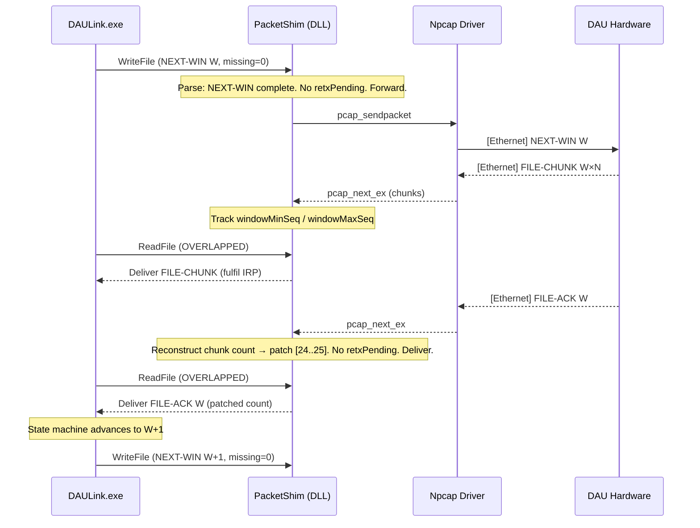
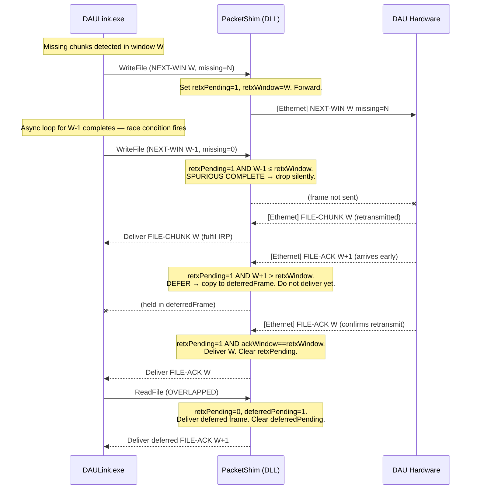
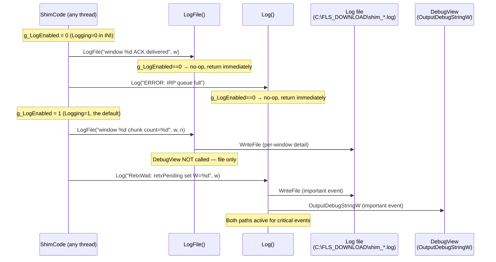

# System Sequence Diagrams (SSD)

**Project:** packet_shim — Npcap shim for DAULink.exe  
**Revision:** 2.0  
**Date:** 2026-05-19

---

The following diagrams show the interaction between DAULink.exe, the injected PacketShim, and the DAU hardware across three scenarios.

---

## 1. Normal File Transfer Flow

The "happy path" — data is requested and acknowledged without packet loss or timing anomalies. The chunk count reconstruction (FR-05) fires silently on every FILE-ACK but is not highlighted here because it is transparent to the participants.

---

## 2. Retransmit — RetxWait and Spurious COMPLETE Drop

This shows how the shim prevents the race condition where DAULink.exe sends a spurious COMPLETE immediately after a RETRANSMIT, and how it holds a premature FILE-ACK for W+N until the retransmit for W is confirmed.

> **Why this matters:** without the spurious COMPLETE drop, that frame would reach the DAU while it is still preparing the retransmit. The DAU would interpret it as "all done, advance" and abandon the retransmit. DAULink.exe would then wait forever for chunks that will never arrive, resulting in an ABORT.

---

## 3. Logging Architecture

This diagram shows how the two-tier logging system works and when each path is active.

**Rule of thumb for contributors:** use `LogFile()` for anything that fires on every window or chunk (per-packet detail that you will read from the file after the fact). Use `Log()` only for events that happen once or twice per transfer — state changes, errors, retransmit start/clear. Calling `Log()` on every packet defeats the purpose of the split because `OutputDebugStringW` is slow under load.
